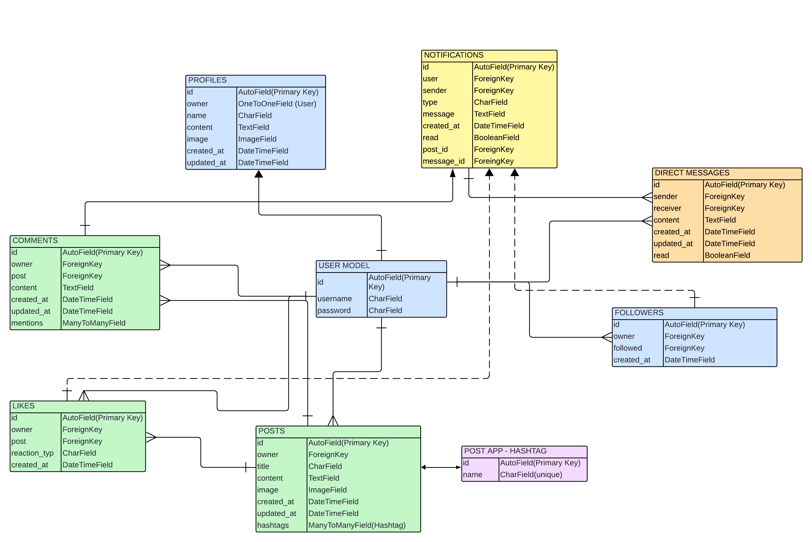

# Znapped

Znapped is built using Django REST Framework. It serves as the API for a social media platform where users can create posts, follow other users, react to content, comment, send direct messages and manage notifications.

The live link can be found here - [znapped-drfapi](https://znapped-drfapi-8eee30ca5ab2.herokuapp.com/)

## Contents

- [Features](#)
    - [User Management](#user-management)
    - [Content Management](#content-management)
    - [Messaging](#messaging)
    - [Notifications](#notifications)
    - [Search and Filter](#search-and-filter)
- [API Endpoints](#api-endpoints)
    - [User and Profile](#user-and-profile)
    - [Posts](#posts)
    - [Comments](#comments)
    - [Likes](#likes)
    - [Follower](#follower)
    - [Messaging](#messaging)
    - [Notifications](#notifications)
- [Database Models](#database-models)
    - [User model](#user-model)
    - [Profile model](#profile-model)
    - [Post model](#post-model)
    - [Comment model](#comment-model)
    - [Like model](#like-model)
    - [Follower model](#follower-model)
    - [Direct Message model](#direct-message-model)
    - [Notification model](#notification-model)
- [Testing](#testing)
- [Technologies used](#technologies-used)
- [Libraries & Frameworks](#libraries--frameworks)
- [Tools & Programs](#tools--programs)
- [Deployment](#deployment)
    - [Heroku](#heroku)
- [Credits](#credits)
  - [Code](#code)
  - [Content](#content)
  - [Media](#media)
  - [Acknowledgements](#acknowledgements)

## Features

### User Management
- User profiles with custom fields.
- User authentication using JWT.
- Follow and unfollow functionality

### Content Management
- Create, edit delete posts with images, hashtags and mentions.
- Add, edit and comments on posts.
- React to posts with different reaction types (heart, thumbs up, happy, sad, angry).

### Messaging
- Direct messages between users with read status tracking.
- Notifications for new messages.

### Notifications
- Notifications for likes, follows and messages.
- Mark notifications as read.

### Search and Filter
- Search functionality for posts, hashtags and users.
- Filter posts by likes, comments, hashtags and followers.

## API Endpoints

### User and Profile
- GET /profiles/ - List all user profiles
- GET /profiles/<id>/ -  Retrieve a single profile
- PUT /profiles/<id>/ - Update profile details, only for authenticated users.

### Posts
- GET /posts/ - List all posts
- POST /posts/ - Create a new post
- GET /posts/<id>/ - Retrieve a specific post
- PUT /posts/<id>/ - Update a post (owner only)
- DELETE /posts/<id>/ - Delete a post (owner only)

### Comments
- GET /comments/ - List all comments
- POST /comments/ - Create a comment
- PUT /comments/<id>/ - Update a comment (owner only)
- DELETE /comments/<id>/ - Delete a comment (owner only)

### Likes
- GET /likes/ - List all likes
- POST /likes/ - React to a post
- PUT /comments/<id>/ - Update a comment (owner only)
- DELETE /likes/<id>/ - Remove a reaction (owner only)

### Follower
- GET /followers/ - List all followers
- POST /followers/ - Follow a user
- DELETE /followers/<id>/ -Unfollow a user (owner only)

### Messaging
- GET /direct-messages/ - List all messages
- POST /direct-messages/ - Send a message
- PATCH /direct-messages/mark-as-read - Mark messages as read.

### Notifications
- GET /notifications/ - List all notifications
- PATCH /notifications/mark-as-read - Mark notifications as read.

## Database Models
The entity relationship diagram provided is the first draft and does not include all the fields and models in the final database.

  
Database schema

  

#### User Model
Handles user authentication and user management.

Relationships:
- One-to-one relationship with the Profile model.
- One-to-many relationship with the Post, Comment, DirectMessage, Like and Follower models.

#### Profile Model
Represents a user's profile with additional information like, bio, image, post and follower count.

Fields:
- owner (One-to-one with User)
- name
- content
- image
- followers_count
- following_count
- post_count.

Relationships:
- One-to-one relationship with the User model.
- Connected to Follower Model via the User model to link followers and following.

#### Post Model
Represents user-generated posts, including support for images and hashtags.

Fields:
- title
- content
- image
- hashtags
- mentions
- created_at
- updated_at

Relationships:
- Many-to-one relationship with the User model.
- One-to-many relationship with the Comment and Like models.
- Many-to-many relationship with the Hashtag model

#### Comment Model
Represents a comment on a post.

Fields:
- content
- post
- mentions
- owner
- created_at
- updated_at

Relationships:
- Many-to-one relationship with the User model.
- Many-to-one relationship with the Post model.
- Many-to-many relationship with the User model (for mentions).

#### Like Model
Represents a reaction to a post.

Fields:
- owner
- post
- reaction_type
- created_at

Relationships:
- Many-to-one relationship with the User model.
- Many-to-one relationship with the Post model.

#### Follower Model
Represents a user following another user.

Fields:
- owner
- followed
- created_at

Relationships:
- Many-to-one relationship with the User model (as owner)
- Many-to-one relationship with the User model (as followed)

#### Direct Message Model
Represents a private message between users.

Fields:
- sender
- receiver
- content
- read
- created_at
- updated_at

Relationships:
- Many-to-one relationship with the User model (as sender).
- Many-to-one relationship with the User model (as receiver).
#### Notification Model
Tracks notifications for user activities such as likes, messages and mentions.

Fields:
- type
- message
- user
- sender
- post
- message_id
- created_at
- read

Relationships:
- Many-to-one relationship with the User model (as user and sender)
- Many-to-one relationship with the DirectMessage model.

## Testing
Testing and the results can be found [here](/TESTING.md).

## Technologies

  - [Chrome Dev Tools](https://developer.chrome.com/docs/devtools/) - Was used throughout the project to make changes and to test the responsivness.
  - [Django](https://docs.djangoproject.com/en/5.0/) - Main python framework for development of this project.
  - [ElephantSQL](https://www.elephantsql.com/) - PostgreSQL database hosting for this project.
  - [Git](https://git-scm.com/) - Git was used for version control by using the Gitpod terminal to commit and then push to Github.
  - [Github](https://github.com/) - Is where the projects code is stored after being pushed.
  - [Gitpod](https://gitpod.io/) - Was the Codespace used for this project.
  - [Heroku](https://www.heroku.com) - The cloud based platform to deploy the site on.
  - [JWT] - Used for authentication

  ## Libraries & Frameworks
  - [Cloudinary](https://cloudinary.com/) - Used for media storage
  - [Django-allauth](https://docs.allauth.org/en/latest/) - Authentication library used to create the user accounts.
 the project.
  - [Gunicorn](https://docs.djangoproject.com/en/5.0/howto/deployment/wsgi/gunicorn/) - Python HTTP server for WSGI applications.
  - [Psycopg2](https://pypi.org/project/psycopg2/) - PostgreSQL database adapter for Python.
  - [Whitenoise](https://whitenoise.readthedocs.io/en/latest/) - To serve static files directly from Django.

  Additional information is available in the [requirements.txt file](requirements.txt)

## Deployment

### Heroku
The application was deployed to Heroku using the following steps:

#### Create the Heroku App
1. Log in to Heroku
2. Click on New and select Create new app from the drop-down menu.
3. Enter a unique and appropiate app name.
4. Select you region.
5. Click on "Create App"

#### Create the PostgreSQL database using ElephantSQL
1. Log in to ElephantSQL and navigate to Dashboard.
2. Click on "Create New Instance".
3. Provide a project name and choose "Tiny Turtle", the free plan.
4. Click on "Select Region" and choose Data center.
5. Review all the details and click on "Create Instance".
6. Return to the Dashboard and click on the newly created instance and copy the database URL.

#### Create and prepare files

- Create requirements.txt file
- Create a "Procfile" in the main directory and add: web: gunicorn project-name.wsgi

  ##### Env.py file
  - Create an env.py file in the main directory in your Gitpod workspace and ensure it's included in the .gitignore file.
  - Add the DATABASE_URL and SECRET_KEY to the env.py file.
  - Add the Cloudinary URL to env.py.

  ##### Settings.py file
  - Update the settings.py file to import the env.py file.
  - Add the SECRET_KEY and DATABASE_URL file paths.
  - Comment out the default database configuration.
  - Add Cloudinary to the list of installed apps.
  - Add the settings for STATIC files:
    - The URL
    - Directory path
    - Rooth path
    - Storage path
    - Media URL
    - Default file storage path
  - Link the file to the templates directory in Heroku
  - Change the templates directory to TEMPLATES_DIR
  - Add Heroku to the ALLOWED_HOSTS list

  #### Heroku Config Vars
  Add these Config Vars in Heroku:
  - SECRET_KEY and value
  - CLOUDINARY_URL
  - PORT: 8000
  - DISABLE_COLLECTSTATIC = 1

### Deploy
  - DEBUG in settings.py needs to be set to False before deploying.
  - Navigate to the deploy tab on Heroku and connect to Github and choose your repository.
  - Click on "Enable Automatic Deploys" for automatic deploys or "Deploy Branch" for manual deploys.
  - Click on view or open app to view the deployed site.

### Fork
- Navigate to the repository [Znapped](https://github.com/MilenTecle/Inventory-Manager/tree/main).
- On the right side of the page, at the top of the repository, select "Fork".
- A copy of the repository is now created.

### Clone
1. Navigate to the repository [Znapped](https://github.com/MilenTecle/Inventory-Manager/tree/main).
2. Click on the **'Code'** dropdown menu above the list of files and choose a method to copy the URL, via HTTPS, SSH or GitHub CLI.
3. Open **Terminal**, change the current working directory to the desired location of the cloned directory.
4. Type **'git clone'** and paste the URL copied form GitHub.
5. Type **'Enter'** to create the local clone.

The live link can be found here - [Znapped](https://inventory-manager-milen-aa94458871b4.herokuapp.com/)

## Credits

### Code

#### General
- I Think, Therefore I Blog - I relied on the instructions and walkthrough to setup my project.
- [Integrating Cloudinary-storage](https://dev.to/spymonk/integrating-cloudinary-storage-with-django-4ipb)
- [Django reverse import](https://docs.djangoproject.com/en/5.0/ref/urlresolvers/)
- [Change display name in django admin](https://forum.djangoproject.com/t/django-admin-page-edit-app-names/14720)
- [Debug toolbar](https://django-debug-toolbar.readthedocs.io/en/latest/installation.html) - Was used when building the project to further investigate errors.
- [Style the login and signup form](https://github.com/danihodovic/django-allauth-ui) - Style concept was taken from here.

#### Django Authentication System

- [Django authentication system](https://docs.djangoproject.com/en/5.0/topics/auth/default/)

- [Django allauth installation guide ](https://docs.allauth.org/en/latest/installation/quickstart.html)

- [Using Google](https://medium.com/@infowithkiiru/django-user-registration-with-google-67524cce5ab7)
- [Django google oauth](https://pylessons.com/django-google-oauth)

### Content
The content is written by the developer.

### Acknowledgements
- Antonio, my mentor, for guiding med throughout the project with important suggestions to improve the applications funcionality.
- To the slack community for answering my questions and guiding me.
- To tutor support, for helping me when I got stuck trying to solve problems throughout the project.
- To my husband and family, for all the support and patience throughout this project.