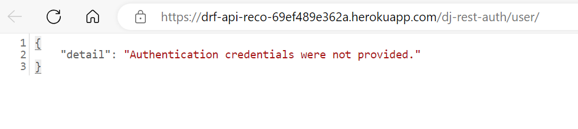
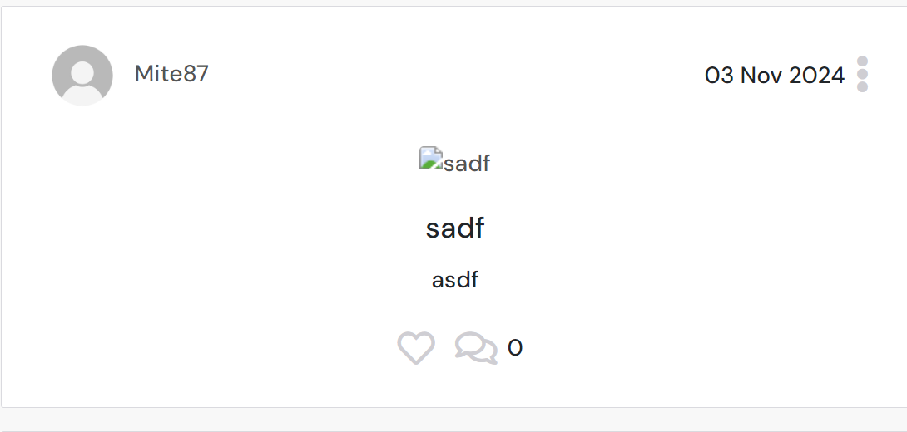
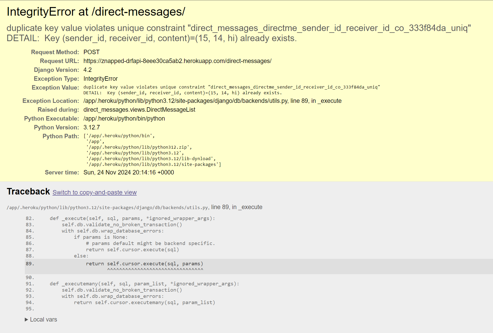
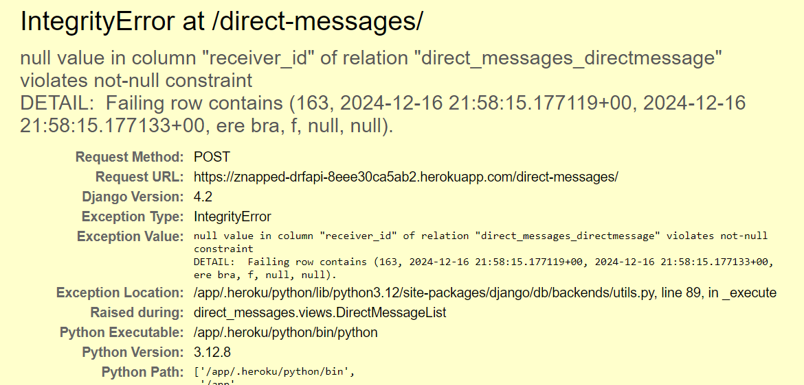
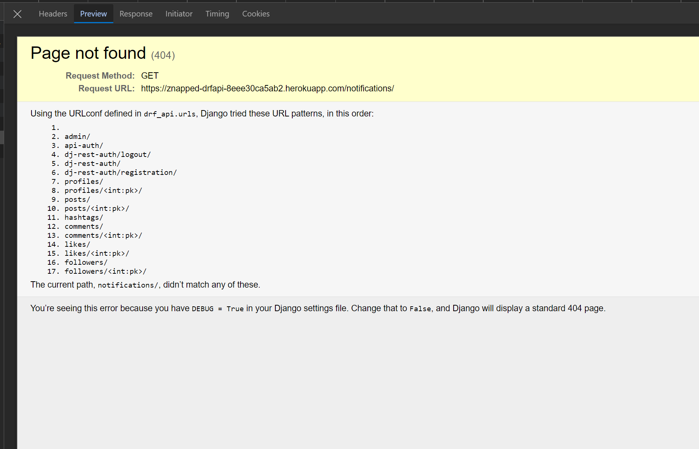

## Contents

- [Testing](#testing)
    - [Validator Tests](#validator-tests)
    - [Manual Testing](#manual-testing)
    - [Automated Testing](#python-automated-testing)
- [Bugs](#bugs)

## Validator Testing

### [PEP8 - CI](https://pep8ci.herokuapp.com/)

|**TEST**|**ACTION**|**EXPECTATION**|**RESULT**|
|-------------------------|---------------------------|---------------------------|-------------|
|**drf-api project** |
|&nbsp;&nbsp;permissions.py | [PEP8 - CI](https://pep8ci.herokuapp.com/) | [No issues found](docs/testing-images/drf-api-project/permissions.PNG) | ✅ |
|&nbsp;&nbsp;serializers.py | [PEP8 - CI](https://pep8ci.herokuapp.com/) | [No issues found](docs/testing-images/drf-api-project/seralizers.PNG)  | ✅ |
|&nbsp;&nbsp;settings.py | [PEP8 - CI](https://pep8ci.herokuapp.com/) |[No issues found](docs/testing-images/drf-api-project/settings.PNG)   | ✅ |
|&nbsp;&nbsp;urls.py | [PEP8 - CI](https://pep8ci.herokuapp.com/) |[No issues found](docs/testing-images/drf-api-project/urls.PNG) | ✅ |
|&nbsp;&nbsp;views.py | [PEP8 - CI](https://pep8ci.herokuapp.com/) | [No issues found](docs/testing-images/drf-api-project/views.PNG)  | ✅ |

|**TEST**|**ACTION**|**EXPECTATION**|**RESULT**|
|-------------------------|---------------------------|---------------------------|-------------|
|**comments** |
|&nbsp;&nbsp;admin.py | [PEP8 - CI](https://pep8ci.herokuapp.com/) | [No issues found](docs/testing-images/comments/admin.PNG) | ✅ |
|&nbsp;&nbsp;apps.py | [PEP8 - CI](https://pep8ci.herokuapp.com/) | [No issues found](docs/testing-images/comments/apps.PNG) | ✅ |
|&nbsp;&nbsp;models.py | [PEP8 - CI](https://pep8ci.herokuapp.com/) | [No issues found](docs/testing-images/comments/models.PNG) | ✅ |
|&nbsp;&nbsp;serializers.py | [PEP8 - CI](https://pep8ci.herokuapp.com/) | [No issues found](docs/testing-images/comments/serializers.PNG) | ✅ |
|&nbsp;&nbsp;urls.py | [PEP8 - CI](https://pep8ci.herokuapp.com/) | [No issues found](docs/testing-images/comments/urls.PNG) | ✅ |
|&nbsp;&nbsp;views.py | [PEP8 - CI](https://pep8ci.herokuapp.com/) | [No issues found](docs/testing-images/comments/views.PNG) | ✅ |

|**TEST**|**ACTION**|**EXPECTATION**|**RESULT**|
|-------------------------|---------------------------|---------------------------|-------------|
|**direct_messages** |
|&nbsp;&nbsp;admin.py | [PEP8 - CI](https://pep8ci.herokuapp.com/) | [No issues found](docs/testing-images/direct-messages/admin.PNG) | ✅ |
|&nbsp;&nbsp;apps.py | [PEP8 - CI](https://pep8ci.herokuapp.com/) | [No issues found](docs/testing-images/direct-messages/apps.PNG) | ✅ |
|&nbsp;&nbsp;models.py | [PEP8 - CI](https://pep8ci.herokuapp.com/) | [No issues found](docs/testing-images/direct-messages/models.PNG) | ✅ |
|&nbsp;&nbsp;serializers.py | [PEP8 - CI](https://pep8ci.herokuapp.com/) | [No issues found](docs/testing-images/direct-messages/serializers.PNG)| ✅ |
|&nbsp;&nbsp;urls.py | [PEP8 - CI](https://pep8ci.herokuapp.com/) | [No issues found](docs/testing-images/direct-messages/urls.PNG) | ✅ |
|&nbsp;&nbsp;views.py | [PEP8 - CI](https://pep8ci.herokuapp.com/) | [No issues found](docs/testing-images/direct-messages/views.PNG) | ✅ |

**TEST**|**ACTION**|**EXPECTATION**|**RESULT**|
|-------------------------|---------------------------|---------------------------|-------------|
|**followers** |
|&nbsp;&nbsp;admin.py | [PEP8 - CI](https://pep8ci.herokuapp.com/) | [No issues found](docs/testing-images/followers/admin.PNG) | ✅ |
|&nbsp;&nbsp;apps.py | [PEP8 - CI](https://pep8ci.herokuapp.com/) |[No issues found](docs/testing-images/followers/apps.PNG)  | ✅ |
|&nbsp;&nbsp;models.py | [PEP8 - CI](https://pep8ci.herokuapp.com/) | [No issues found](docs/testing-images/followers/models.PNG) | ✅ |
|&nbsp;&nbsp;serializers.py | [PEP8 - CI](https://pep8ci.herokuapp.com/) | [No issues found](docs/testing-images/followers/serializers.PNG) | ✅ |
|&nbsp;&nbsp;urls.py | [PEP8 - CI](https://pep8ci.herokuapp.com/) | [No issues found](docs/testing-images/followers/urls.PNG)  | ✅ |
|&nbsp;&nbsp;views.py | [PEP8 - CI](https://pep8ci.herokuapp.com/) | [No issues found](docs/testing-images/followers/views.PNG) | ✅ |

**TEST**|**ACTION**|**EXPECTATION**|**RESULT**|
|-------------------------|---------------------------|---------------------------|-------------|
|**likes** |
|&nbsp;&nbsp;admin.py | [PEP8 - CI](https://pep8ci.herokuapp.com/) | [No issues found](docs/testing-images/likes/admin.PNG) | ✅ |
|&nbsp;&nbsp;apps.py | [PEP8 - CI](https://pep8ci.herokuapp.com/) | [No issues found](docs/testing-images/likes/apps.PNG)| ✅ |
|&nbsp;&nbsp;models.py | [PEP8 - CI](https://pep8ci.herokuapp.com/) | [No issues found](docs/testing-images/likes/models.PNG) | ✅ |
|&nbsp;&nbsp;serializers.py | [PEP8 - CI](https://pep8ci.herokuapp.com/) | [No issues found](docs/testing-images/likes/serializers.PNG) | ✅ |
|&nbsp;&nbsp;urls.py | [PEP8 - CI](https://pep8ci.herokuapp.com/) | [No issues found](docs/testing-images/likes/urls.PNG) | ✅ |
|&nbsp;&nbsp;views.py | [PEP8 - CI](https://pep8ci.herokuapp.com/) | [No issues found](docs/testing-images/likes/views.PNG)| ✅ |

**TEST**|**ACTION**|**EXPECTATION**|**RESULT**|
|-------------------------|---------------------------|---------------------------|-------------|
|**notifications** |
|&nbsp;&nbsp;admin.py | [PEP8 - CI](https://pep8ci.herokuapp.com/) | [No issues found](docs/testing-images/notifications/admin.PNG) | ✅ |
|&nbsp;&nbsp;apps.py | [PEP8 - CI](https://pep8ci.herokuapp.com/) | [No issues found](docs/testing-images/notifications/apps.PNG) | ✅ |
|&nbsp;&nbsp;models.py | [PEP8 - CI](https://pep8ci.herokuapp.com/) | [No issues found](docs/testing-images/notifications/models.PNG)| ✅ |
|&nbsp;&nbsp;serializers.py | [PEP8 - CI](https://pep8ci.herokuapp.com/) | [No issues found](docs/testing-images/notifications/serializers.PNG) | ✅ |
|&nbsp;&nbsp;signals.py | [PEP8 - CI](https://pep8ci.herokuapp.com/) | [No issues found](docs/testing-images/notifications/signals.PNG) | ✅ |
|&nbsp;&nbsp;urls.py | [PEP8 - CI](https://pep8ci.herokuapp.com/) | [No issues found](docs/testing-images/notifications/urls.PNG) | ✅ |
|&nbsp;&nbsp;views.py | [PEP8 - CI](https://pep8ci.herokuapp.com/) | [No issues found](docs/testing-images/notifications/views.PNG) | ✅ |

**TEST**|**ACTION**|**EXPECTATION**|**RESULT**|
|-------------------------|---------------------------|---------------------------|-------------|
|**posts** |
|&nbsp;&nbsp;admin.py | [PEP8 - CI](https://pep8ci.herokuapp.com/) | [No issues found](docs/testing-images/posts/admin.PNG) | ✅ |
|&nbsp;&nbsp;apps.py | [PEP8 - CI](https://pep8ci.herokuapp.com/) | [No issues found](docs/testing-images/posts/apps.PNG) | ✅ |
|&nbsp;&nbsp;models.py | [PEP8 - CI](https://pep8ci.herokuapp.com/) | [No issues found](docs/testing-images/posts/models.PNG) | ✅ |
|&nbsp;&nbsp;serializers.py | [PEP8 - CI](https://pep8ci.herokuapp.com/) | [No issues found](docs/testing-images/posts/serializers.PNG) | ✅ |
|&nbsp;&nbsp;urls.py | [PEP8 - CI](https://pep8ci.herokuapp.com/) | [No issues found](docs/testing-images/posts/urls.PNG)| ✅ |
|&nbsp;&nbsp;views.py | [PEP8 - CI](https://pep8ci.herokuapp.com/) | [No issues found](docs/testing-images/posts/views.PNG) | ✅ |

**TEST**|**ACTION**|**EXPECTATION**|**RESULT**|
|-------------------------|---------------------------|---------------------------|-------------|
|**profiles** |
|&nbsp;&nbsp;admin.py | [PEP8 - CI](https://pep8ci.herokuapp.com/) | [No issues found](docs/testing-images/profiles/admin.PNG) | ✅ |
|&nbsp;&nbsp;apps.py | [PEP8 - CI](https://pep8ci.herokuapp.com/) | [No issues found](docs/testing-images/profiles/apps.PNG)| ✅ |
|&nbsp;&nbsp;models.py | [PEP8 - CI](https://pep8ci.herokuapp.com/) | [No issues found](docs/testing-images/profiles/models.PNG) | ✅ |
|&nbsp;&nbsp;serializers.py | [PEP8 - CI](https://pep8ci.herokuapp.com/) | [No issues found](docs/testing-images/profiles/serializers.PNG) | ✅ |
|&nbsp;&nbsp;urls.py | [PEP8 - CI](https://pep8ci.herokuapp.com/) | [No issues found](docs/testing-images/profiles/urls.PNG)| ✅ |
|&nbsp;&nbsp;views.py | [PEP8 - CI](https://pep8ci.herokuapp.com/) | [No issues found](docs/testing-images/profiles/views.PNG)| ✅ |

## Manual Testing

### Testing API Endpoints and Responses
|**Endpoint** | **Result** |
|-------------------------------|-----------|
| **Profiles**                          |     |
| GET `/profiles/`                          | ✅ |
| GET `/profiles/<pk>/`                     | ✅ |
| PUT `/profiles/<pk>/`                     | ✅ |
| **Posts**                                 |
| GET `/posts/`                             | ✅ |
| POST `/posts/`                            | ✅ |
| GET `/posts/<pk>/`                        | ✅ |
| PUT `/posts/<pk>/`                        | ✅ |
| DELETE `/posts/<pk>/`                     | ✅ |
| **Comments**                              |     |
| GET `/comments/`                          | ✅ |
| POST `/comments/`                         | ✅ |
| PUT `/comments/<pk>/`                     | ✅ |
| DELETE `/comments/<pk>/`                  | ✅ |
| **Likes**                                 |     |
| GET `/likes/`                             | ✅ |
| POST `/likes/`                            | ✅ |
| DELETE `/likes/<pk>/`                     | ✅ |
| **Follower**                              |     |
| GET `/followers/`                         | ✅ |
| POST `/followers/`                        | ✅ |
| DELETE `/followers/<pk>/`                 | ✅ |
| **Messaging**                             |     |
| GET `/direct-messages/`                   | ✅ |
| POST `/direct-messages/`                  | ✅ |
| PATCH `/direct-messages/mark-as-read`     | ✅ |
| DELETE `/direct-messages/<pk>/`           | ✅ |
| **Notifications**                         |     |
| GET `/notifications/`                     | ✅ |
| PATCH `/notifications/mark-as-read`       | ✅ |
| DELETE `/notifications/<pk>`              | ✅ |

### Testing CRUD Operations
**App**|**Create**|**Read**|**Update**|**Delete**|
|------|-------|-----|----|--------|
| **Profiles** | ✅ | ✅ | ✅ | --- |
| **Posts** | ✅ | ✅ | ✅ |  ✅|
| **Comments** | ✅ | ✅ | ✅ |  ✅|
| **Likes** | ✅ | ✅ | --- |  ✅|
| **Followers** | ✅ | ✅ | --- |  ✅|
| **Messaging** | ✅ | ✅ | ✅ |  ✅|
| **Notifications** | --- | ✅ | ✅ |  ✅|

## Python Automated Testing
Automated testing was conducted on specific components of the application, focusing on key features utilizing Django's built-in 'TestCase' class. Although, given more time the intention was to extend the automated tests to include more features and scenarios. A thourough manual testing process was also implemented.

**Test** | **Description** | **Result** |
|:-----|:------|:------|
|test_inventory_form_valid| Verifies that the "InventoryForm" is validated when provided with a valid category and name. This test ensures that the form's validation logic properly accepts correct input.| Passed
|test_inventory_form_invalid| Tests the "InventoryForm" for correct handling of invalid submissions, specifically when mandatory fields are missing. This test is to confirm that the form's logic handles incomple och incorrect submissions correctly.| Passed
|test_items_form_valid| Verifies that the "ItemsForm" validates correctly when provided with valid data. This test ensures that the form properly handles valid user inputs for item creation.| Passed
|test_items_form_invalid| Test the form handling for invalid submissions, such as when item name is missing.  This test is to confirm that the form's logic handles incomplete och incorrect submissions correctly to prevent data integrity errors.| Passed
|test_create_inventory| Tests the functionality of creating a new inventory list through a POST request, verifying that the list is correctly added to the database and that the user is redirected correctly.| Passed
|test_delete_list| Tests the functionality of deleting an inventory list, verifying that after deletion, the list is deleted from the database and the user redirected correctly.| Passed

## Bugs
I encountered numerous bugs and errors throughout this project. A lot of the errors and bugs I encountered were learning curves, initial hurdles and typos. Other bugs were related to my CORS_ALLOWED_ORIGINS settings and CSRF_TRUSTED_ORIGINS settings. I also had to downgrade installed packages to resolve issues as eg. images were not displaying.

The images below will display some of the issues resolved:

  
Authentication credentials not provided

  

  
CSRF verification failed

  .PNG)

  
Images not displaying

  

  
IntegrityError unique constraint

  

  
IntegrityError receiver_id

  

  
Page not found

  

